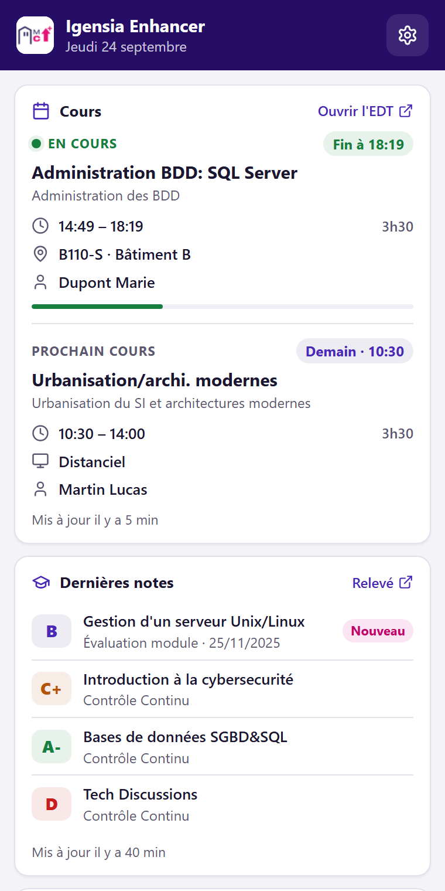
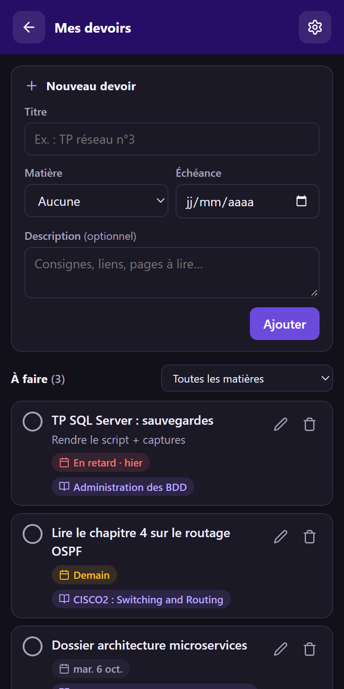
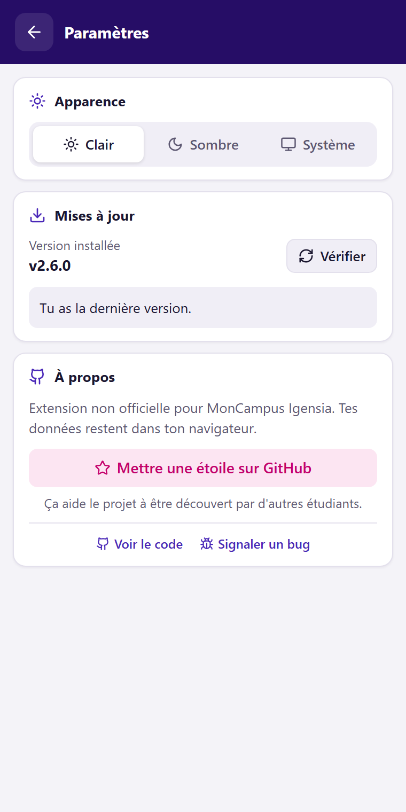
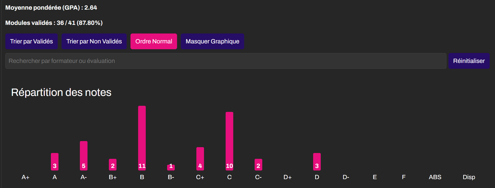
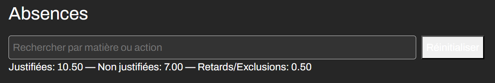

# Igensia Extension
 
## Version: 2.6.0

Extension de navigateur (Chrome, Edge, Firefox) pour MonCampus Igensia : ton prochain cours et tes dernières notes en un clic, un suivi de devoirs par matière, et des outils en plus sur les pages de notes et d'absences.

Le code de l'extension se trouve dans le dossier `IgensiaExtension`.

## Démo rapide

	
	
	
	 
	<em>Popup de l'extension : Accueil • Mes devoirs (thème sombre) • Paramètres</em>

	
	
	 
	<em>Sur MonCampus : Relevé de notes • Résumé des absences</em>

## Objectif

Ce README explique comment télécharger le projet et l'importer dans un navigateur (Chrome/Edge et Firefox) pour le tester en mode développement.

## Fonctionnalités

- Popup
	- Cours en cours (avec avancement) et prochain cours : horaires, salle ou distanciel, prof
	- Dernières notes, avec l'étiquette « Nouveau » pour celles pas encore vues
	- Synchronisation automatique de l'emploi du temps et du relevé de l'année en cours (il suffit de les avoir ouverts une fois dans la session)

- Mes Devoirs (dans le popup)
	- Ajouter, modifier, cocher comme terminé et supprimer des devoirs
	- Matière à choisir parmi celles du relevé et de l'EDT, filtre par matière
	- Échéance suggérée au prochain cours de la matière, échéances colorées (en retard, aujourd'hui, demain)

- Notes (pages MonCampus/Wigor)
	- Calcul automatique de la moyenne pondérée (GPA) et du pourcentage de modules validés
	- Tri rapide par « Validés », « Non Validés », « Date » ou « Ordre normal »
	- Recherche par formateur ou évaluation
	- Filtre « Afficher uniquement matières avec notes »
	- Graphique de répartition des notes (afficher/masquer)
	- Export PDF du relevé de notes

- Objectif GPA
	- Barre de progression sur échelle fixe 0 → 4.0
	- Curseur d'objectif déplaçable à la souris
	- Palette de couleurs 4 paliers : rouge → orange → jaune → vert
	- Sauvegarde persistante de l'objectif

- Simulateur de notes
	- Mode simulation activable/désactivable avec persistance
	- Ajout de notes hypothétiques avec coefficient
	- Modification des notes existantes (✏️) avec mise à jour visuelle instantanée
	- Moyenne simulée séparée

- Absences
	- Récapitulatif des heures: Justifiées, Non justifiées, Retards/Exclusions
	- Recherche/filtre par matière ou action
	- Récupération résiliente via le service worker (fallback en cas d'erreurs réseau/CORS)

- Alertes de notes
	- Notification automatique (toutes les 2 h) lors de nouvelles notes, avec un badge sur l'icône

- Temps passé sur MonCampus
	- Suivi automatique du temps (aujourd'hui, semaine, total)

- Mises à jour
	- Vérification automatique toutes les 6h via le manifest distant (GitHub)
	- Badge sur le bouton « Paramètres » quand une nouvelle version est disponible
	- Actions dans les paramètres: « Voir » (ouvrir GitHub) ou « Ignorer » (retirer le badge)

- Paramètres et thème
	- Thème clair, sombre ou système, mémorisé entre les sessions

- Intégration MonCampus
	- Insertion d'un bouton/onglet « Mes Devoirs » pour ouvrir rapidement le popup

- Vie privée
	- Données stockées localement dans le navigateur; aucune télémétrie
	- Permissions limitées aux domaines MonCampus/Wigor (dont `cas-p.wigorservices.net`, le serveur de connexion, pour se reconnecter automatiquement) et à GitHub (pour la vérification de mise à jour)

## Prérequis

- Git (optionnel si vous téléchargez l'archive ZIP depuis GitHub)
- Un navigateur Chromium (Chrome, Microsoft Edge) ou Firefox
- PowerShell (exemples fournis pour Windows)

## Télécharger le projet

Option 1 — Cloner avec Git (recommandé si vous voulez suivre les mises à jour) :

	git clone https://github.com/quelquun667/Igensia-Enhancer.git

Option 2 — Télécharger le ZIP depuis GitHub :

- Ouvrez la page du dépôt sur GitHub et cliquez sur "Code" → "Download ZIP".
- Décompressez l'archive. Le dossier principal contenant l'extension s'appelle `IgensiaExtension`.

## Charger l'extension dans Chrome ou Microsoft Edge (mode développeur)

1. Ouvrez Chrome et allez sur `chrome://extensions/` (ou dans Edge : `edge://extensions/`).
2. Activez "Mode développeur" (Developer mode) en haut à droite.
3. Cliquez sur "Charger l'extension non empaquetée" / "Load unpacked".
4. Sélectionnez le dossier `IgensiaExtension` (le dossier qui contient `manifest.json`, `content.js`, etc.).

L'extension sera ajoutée temporairement et visible dans la liste des extensions. Vous pouvez reload la page d'extensions pour forcer le rechargement après modifications.

Remarques :
- Si le manifeste utilise Manifest V3, Chrome/Edge demandera peut-être des permissions ou des confirmations supplémentaires.
- Pour empaqueter l'extension (fichier .crx/.zip), suivez les outils du navigateur ou créez une archive ZIP du dossier.

Exemple PowerShell pour créer une archive ZIP du dossier (optionnel) :

	Compress-Archive -Path .\IgensiaExtension\* -DestinationPath .\igensia-extension.zip -Force

## Charger l'extension dans Firefox (charge temporaire)

1. Ouvrez Firefox et allez sur `about:debugging#/runtime/this-firefox`.
2. Cliquez sur "Load Temporary Add-on..." (ou "Charger un module temporaire").
3. Dans la boîte de dialogue, sélectionnez le fichier `manifest.json` qui se trouve dans le dossier `IgensiaExtension`.

4. Firefox n'accorde pas automatiquement l'accès aux sites en Manifest V3 : ouvrez `about:addons`, cliquez sur Igensia Enhancer → onglet **Permissions**, puis activez l'accès aux sites MonCampus et Wigor. Sans ça, la synchronisation des cours et des notes ne fonctionne pas.

Firefox 115 ou plus récent est nécessaire.

Important : le chargement temporaire n'est pas persistant — l'extension sera désactivée au redémarrage de Firefox. Pour une installation permanente sur Firefox, il faut signer l'extension et la publier sur AMO (addons.mozilla.org) ou l'installer via un paquet signé.

## Dépannage rapide

- Erreur "Manifest is missing or unreadable" : vérifiez que vous avez sélectionné le dossier contenant `manifest.json`.
- Permissions bloquées : relisez `manifest.json` et accordez les permissions demandées lors de l'installation.
- Rafraîchir l'extension : après modification des fichiers, retournez dans la page d'extensions du navigateur et cliquez sur "Reload" / "Recharger".
- Le popup affiche « Session expirée » : ouvrez une fois l'emploi du temps ou le relevé de notes depuis MonCampus pour renouveler la session, puis rouvrez le popup.
