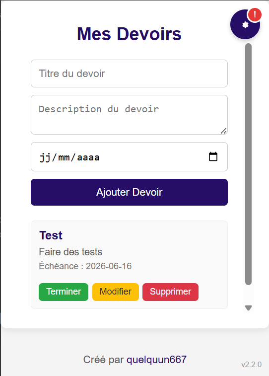

# Igensia Extension
 
## Version: 2.2.5

Ce dépôt contient l'extension de navigateur "Igensia" (dossier `IgensiaExtension`).

## Démo rapide

	
	
	
	 
	<em>De gauche à droite : Mes Devoirs • Répartition des notes • Résumé des absences</em>
	 

## Objectif

Ce README explique comment télécharger le projet et l'importer dans un navigateur (Chrome/Edge et Firefox) pour le tester en mode développement.

## Fonctionnalités

- Mes Devoirs (dans le popup)
	- Ajouter, modifier, terminer et supprimer des devoirs
	- Date d’échéance et affichage clair
	- Thème clair/sombre synchronisé avec le reste de l’extension

- Notes (pages MonCampus/Wigor)
	- Calcul automatique de la moyenne pondérée (GPA) et du pourcentage de modules validés
	- Tri rapide par « Validés », « Non Validés » ou « Ordre normal »
	- Recherche par formateur ou évaluation
	- Graphique de répartition des notes (afficher/masquer)

- Absences
	- Récapitulatif des heures: Justifiées, Non justifiées, Retards/Exclusions
	- Recherche/filtre par matière ou action
	- Récupération résiliente via le service worker (fallback en cas d’erreurs réseau/CORS)

- Mises à jour
	- Vérification automatique toutes les 6h via le manifest distant (GitHub)
	- Badge sur le bouton « Paramètres » quand une nouvelle version est disponible
	- Actions dans les paramètres: « Voir » (ouvrir GitHub) ou « Ignorer » (retirer le badge)

- Paramètres et thème
	- Thème clair/sombre, mémorisé entre les sessions

- Intégration MonCampus
	- Insertion d’un bouton/onglet « Mes Devoirs » pour ouvrir rapidement le popup

- Vie privée
	- Données stockées localement dans le navigateur; aucune télémétrie
	- Permissions limitées aux domaines MonCampus/Wigor et à raw.githubusercontent.com (pour la vérification de mise à jour)

## Prérequis

- Git (optionnel si vous téléchargez l'archive ZIP depuis GitHub)
- Un navigateur Chromium (Chrome, Microsoft Edge) ou Firefox
- PowerShell (exemples fournis pour Windows)

## Télécharger le projet

Option 1 — Cloner avec Git (recommandé si vous voulez suivre les mises à jour) :

	git clone https://github.com/quelquun667/Igensia-Extension.git

Option 2 — Télécharger le ZIP depuis GitHub :

- Ouvrez la page du dépôt sur GitHub et cliquez sur "Code" → "Download ZIP".
- Décompressez l'archive. Le dossier principal contenant l'extension s'appelle `IgensiaExtension`.

## Charger l'extension dans Chrome ou Microsoft Edge (mode développeur)

1. Ouvrez Chrome et allez sur `chrome://extensions/` (ou dans Edge : `edge://extensions/`).
2. Activez "Mode développeur" (Developer mode) en haut à droite.
3. Cliquez sur "Charger l'extension non empaquetée" / "Load unpacked".
4. Sélectionnez le dossier `IgensiaExtension` (le dossier qui contient `manifest.json`, `content.js`, etc.).

L'extension sera ajoutée temporairement et visible dans la liste des extensions. Vous pouvez reload la page d'extensions pour forcer le rechargement après modifications.

Remarques :
- Si le manifeste utilise Manifest V3, Chrome/Edge demandera peut-être des permissions ou des confirmations supplémentaires.
- Pour empaqueter l'extension (fichier .crx/.zip), suivez les outils du navigateur ou créez une archive ZIP du dossier.

Exemple PowerShell pour créer une archive ZIP du dossier (optionnel) :

	Compress-Archive -Path .\IgensiaExtension\* -DestinationPath .\igensia-extension.zip -Force

## Charger l'extension dans Firefox (charge temporaire)

1. Ouvrez Firefox et allez sur `about:debugging#/runtime/this-firefox`.
2. Cliquez sur "Load Temporary Add-on..." (ou "Charger un module temporaire").
3. Dans la boîte de dialogue, sélectionnez le fichier `manifest.json` qui se trouve dans le dossier `IgensiaExtension`.

Important : le chargement temporaire n'est pas persistant — l'extension sera désactivée au redémarrage de Firefox. Pour une installation permanente sur Firefox, il faut signer l'extension et la publier sur AMO (addons.mozilla.org) ou l'installer via un paquet signé.

## Dépannage rapide

- Erreur "Manifest is missing or unreadable" : vérifiez que vous avez sélectionné le dossier contenant `manifest.json`.
- Permissions bloquées : relisez `manifest.json` et accordez les permissions demandées lors de l'installation.
- Rafraîchir l'extension : après modification des fichiers, retournez dans la page d'extensions du navigateur et cliquez sur "Reload" / "Recharger".

## Remarques finales

Ce README couvre le chargement en mode développement. Si vous souhaitez préparer une version distribuable ou publier l'extension, dites-moi quel navigateur vous ciblez en priorité et je peux ajouter les étapes de packaging et publication.

